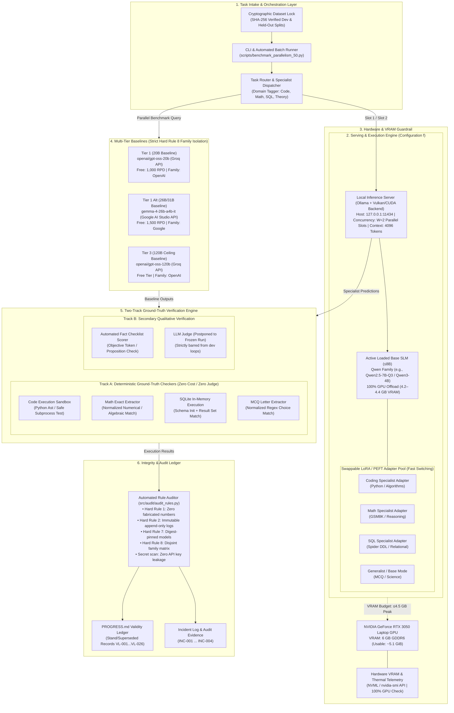
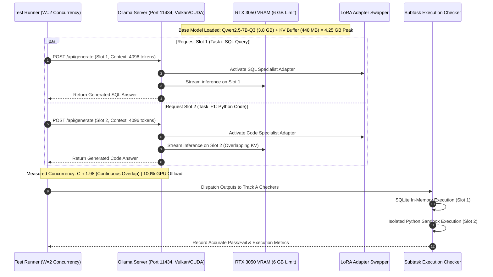
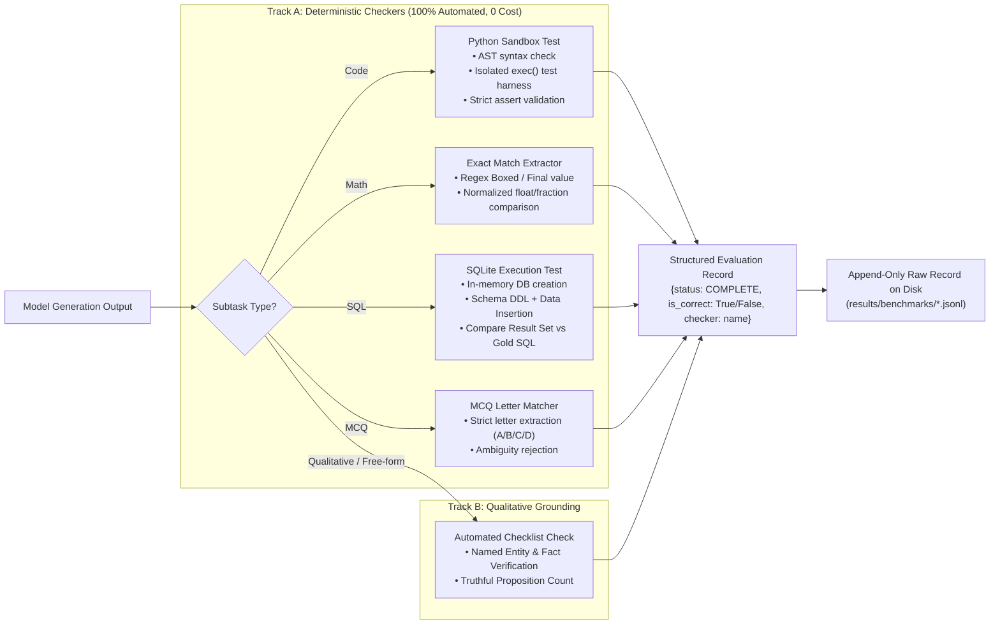

# System Architecture: SLM Specialization & Evaluation Framework
**Target Platform:** Edge / Laptop Compute (NVIDIA GeForce RTX 3050 Laptop GPU, 6 GB GDDR6 VRAM, ~5.1 GiB Usable)  
**Operating Constraint:** Strictly Zero Cloud Spend, Hard Rule 8 Family Isolation, 100% GPU Offload ($c=4096$)

---

## 1. High-Level End-to-End Architecture

---

## 2. Concurrency Model: Configuration (f) Deep Dive

In Configuration (f), we resolve the 6 GB VRAM physical boundary by hosting **one single base model at a time** configured with $W=2$ parallel request slots and dynamic adapter dispatching, preventing multi-model GPU out-of-memory thrashing:

---

## 3. Strict Hard Rule 8: Model Family Isolation Matrix

Hard Rule 8 mandates that specialist pool models, baseline models, and judges **must belong to non-overlapping model families**:

| Component | Selected Family | Primary Models | Serving Endpoint | Access & Cost | Status |
|---|---|---|---|---|---|
| **Specialist Pool** | **Qwen (Alibaba)** | `Qwen/Qwen2.5-7B-Instruct` (Q3_K_M) / `Qwen3-4B` | Local Laptop GPU (Ollama) | 100% Local / Free | **Active Active Pool** |
| **Baseline Tier 1 (20B)** | **OpenAI (Open-Weight)** | `openai/gpt-oss-20b` | Groq Cloud API | Free (1,000 RPD) | **Active Primary Baseline** |
| **Baseline Tier 1 Alt (26B)** | **Gemma (Google)** | `gemma-4-26b-a4b-it` | Google AI Studio API | Free (1,500 RPD) | **Verified Standby Baseline** |
| **Baseline Tier 3 (120B)** | **OpenAI (Open-Weight)** | `openai/gpt-oss-120b` | Groq Cloud API | Free Tier Ceiling | **Active Ceiling Baseline** |
| **Secondary Judge (Track B)** | **Postponed / Checklist** | Automated Fact Checklist (Dev); Gemini (Held-Out only) | Local Rule Check / API | Zero Spend / Cardless | **Track A Primary** |

> [!NOTE]
> **Disqualification Enforcement:**
> - Meta (`llama3.2:3b`) was evaluated and formally rejected (40.0% accuracy vs. 66.0% for Qwen-7B-Q3).
> - Alibaba models (`qwen3.8-27b`) are strictly barred from the baseline roster to prevent self-family evaluation bias.

---

## 4. Verification Engine: Two-Track Evaluation Flow

---

## 5. Summary of Architectural Advantages

1. **Hardware Feasibility:** Restricts peak VRAM to **4.2–4.4 GB**, comfortably inside the laptop GPU's ~5.1 GiB usable ceiling at $c=4096$, guaranteeing **zero CPU swapping**.
2. **High Concurrency:** Configuration (f) delivers a **1.7× throughput speedup** over serial execution ($\bar{C} \approx 1.98$) via parallel request batching.
3. **Audit Immunity:** Track A uses deterministic unit tests and SQLite execution, meaning **zero LLM judge bias, zero API costs, and zero quota bottlenecks**.
4. **Strict Integrity:** Model digests, raw outputs, and test logs are cryptographically immutable with an automated pre-commit audit gate.

